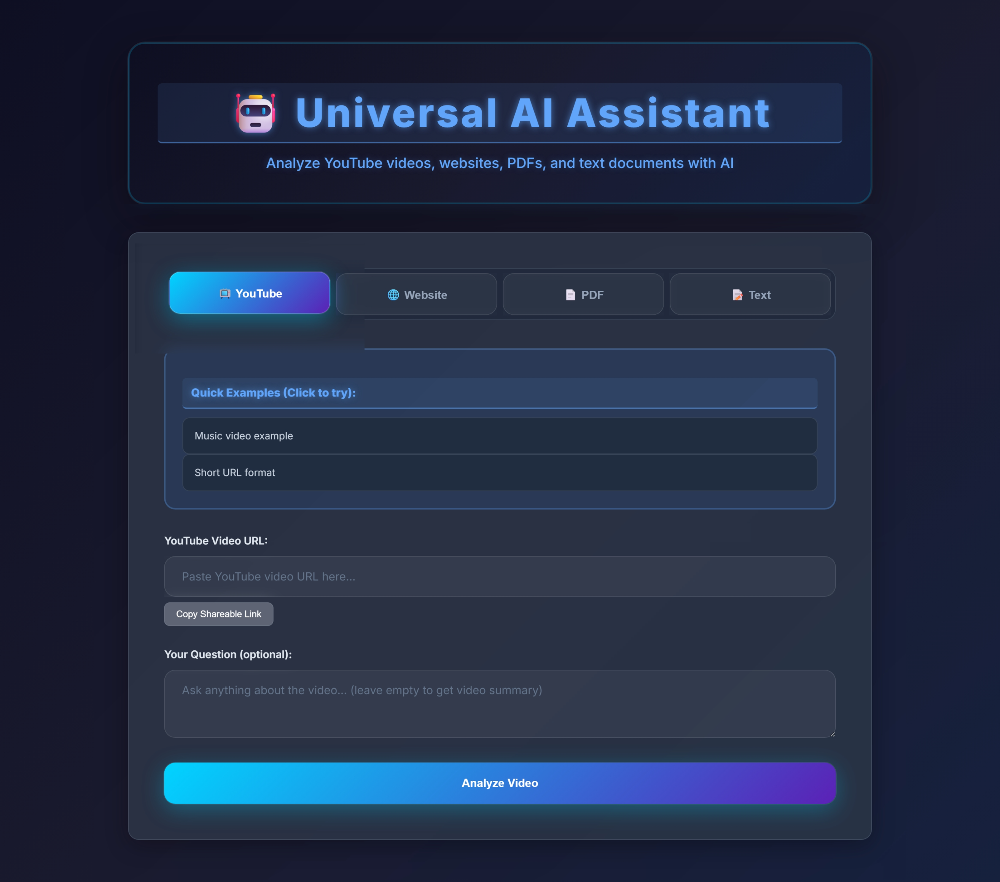
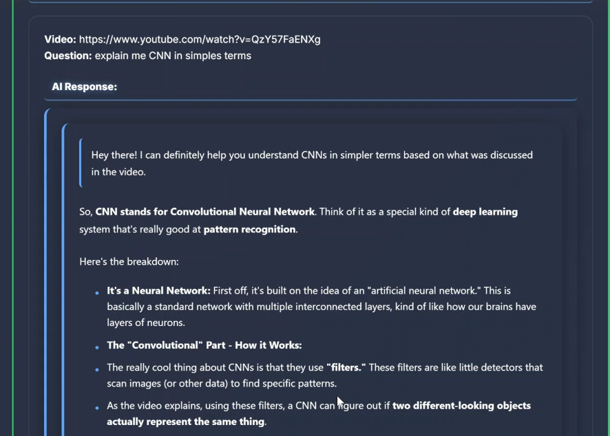
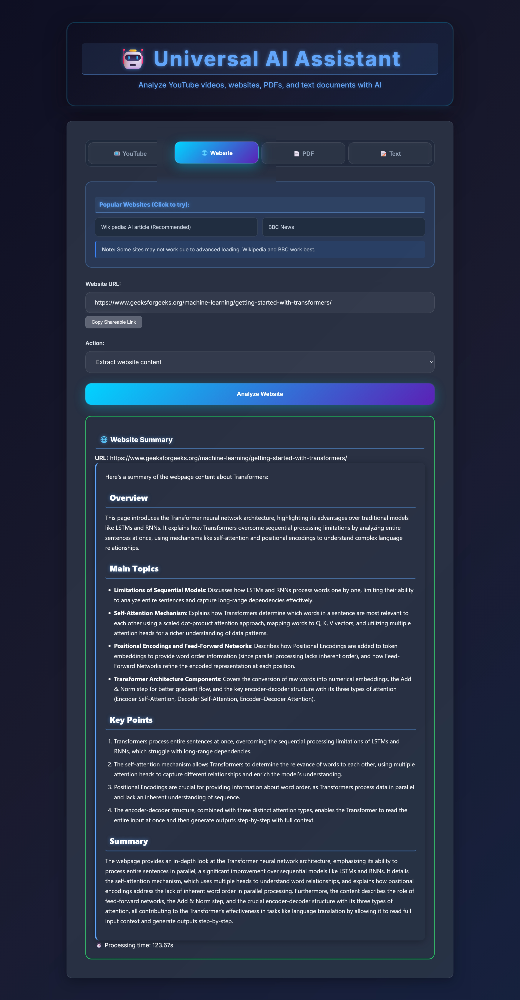
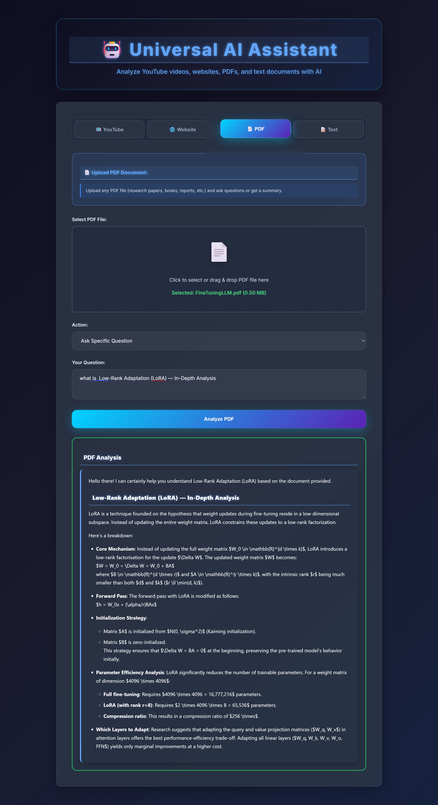
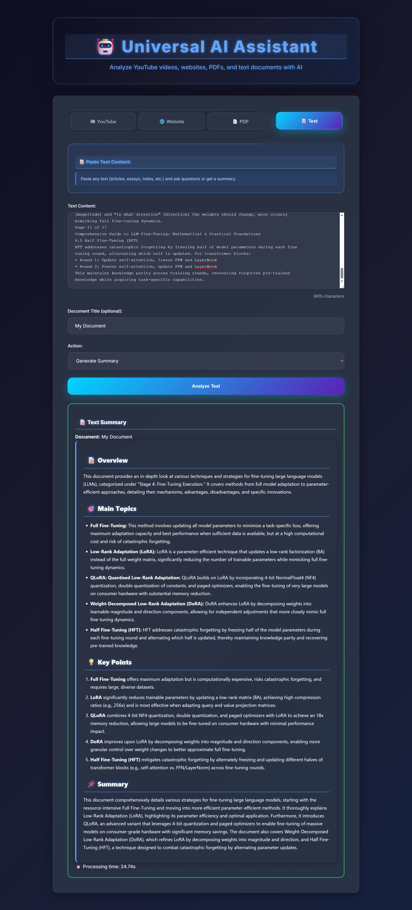
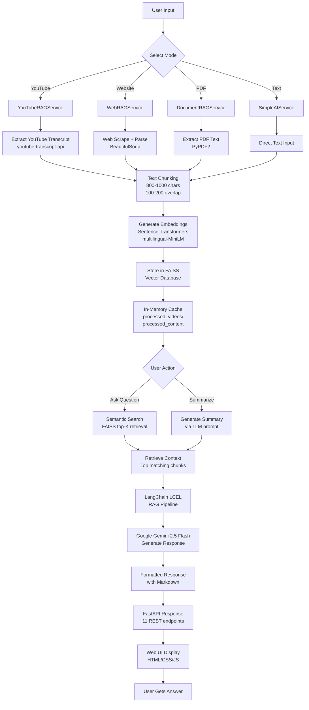

# AI Content Analysis

Analyze YouTube videos, websites, and text documents using AI. Get instant answers to questions about any content.

## 🎬 Demo Video

Watch this demo to see the platform in action:

[](https://drive.google.com/file/d/16gm0cpIDdzRyvRvSDXW4d0UmOJt4T_i1/view?usp=drive_link)

**Video shows:**
- ✅ YouTube video analysis
- ✅ Website content scraping
- ✅ PDF document analysis
- ✅ Text document analysis
- ✅ AI-powered Q&A
- ✅ Real-time processing

[Watch Full Demo](https://drive.google.com/file/d/16gm0cpIDdzRyvRvSDXW4d0UmOJt4T_i1/view?usp=drive_link)

[⬆️ Back to Top](#ai-content-analysis)

## 📸 Screenshots

<details>
<summary><b>🖼️ Click to view screenshots</b></summary>

### Main UI


*Clean dark-themed interface with all 4 modes*

### YouTube Analysis


*Analyze any YouTube video - extract transcripts and get AI answers*

### Website Analysis


*Scrape and analyze any website content with smart parsing*

### PDF Analysis


*Upload PDFs and ask questions about document content*

### Text Analysis


*Paste any text and get instant AI-powered analysis*

</details>

[⬆️ Back to Top](#ai-content-analysis)

## What Can You Do?

- **YouTube Videos** - Ask questions about any YouTube video transcript
- **Websites** - Scrape and analyze website content  
- **Text Documents** - Analyze any text or document
- **AI Answers** - Get instant AI-powered answers using Google Gemini

## System Architecture



### How It Works

1. **Content Extraction** - Extract text from YouTube, web, PDF, or raw text
2. **Chunking** - Split into 800-1000 character chunks with overlap
3. **Embeddings** - Convert text to vectors using Sentence Transformers
4. **Vector Search** - Store vectors in FAISS for semantic search
5. **Retrieval** - Find top-4 most relevant chunks for user question
6. **Generation** - Google Gemini generates response based on retrieved context
7. **Response** - Return formatted answer with sources

## Quick Start (5 minutes)

### 1. Setup

```bash
# Clone or navigate to project
cd AI-Content-Analysis

# Run setup script (Windows PowerShell)
.\scripts\setup.ps1

# OR manual setup (any OS)
pip install -r config/requirements.txt
```

### 2. Configure API Key

Create `server/.env`:
```env
GEMINI_API_KEY=your_api_key_here
```

**Get free API key:**
- Go to https://ai.google.dev
- Click "Get API Key"
- Create a new project
- Copy the key and paste into `.env`

### 3. Start Server

```bash
cd server
python start_server.py
```

You'll see:
```
[OK] YouTube Service loaded
[OK] Web Service loaded
[OK] Document Service loaded
INFO: Uvicorn running on http://0.0.0.0:8000
```

### 4. Use It!

Open browser: **http://localhost:8000**

## Features

### YouTube Analysis
- Extract video transcripts automatically
- Ask any question about the video
- Get comprehensive AI answers
- Works with most YouTube videos

### Website Analysis  
- Scrape website content
- Ask questions about the content
- Get summarized answers
- Works with text-based websites

### Text Analysis
- Paste any text or document content
- Ask questions about it
- Get instant answers
- Works with any length text

### API Endpoints

**YouTube:**
```bash
curl -X POST http://localhost:8000/youtube/simple/ask \
  -H "Content-Type: application/json" \
  -d '{
    "video_url": "https://www.youtube.com/watch?v=...",
    "question": "What is this video about?"
  }'
```

**Website:**
```bash
curl -X POST http://localhost:8000/web/ask-question \
  -H "Content-Type: application/json" \
  -d '{
    "url": "https://example.com",
    "question": "What is this about?"
  }'
```

**Text:**
```bash
curl -X POST http://localhost:8000/documents/text/ask \
  -H "Content-Type: application/json" \
  -d '{
    "text_content": "Your text here...",
    "question": "What are the main points?"
  }'
```

**Health Check:**
```bash
curl http://localhost:8000/health
```

## Project Structure

```
AI-Content-Analysis/
│
├── README.md                       (You are here)
├── START_HERE.md                   (Quick start guide)
├── LICENSE                         (MIT License)
├── .gitignore                      (Git ignore rules)
│
├── config/                         (Configuration)
│   └── requirements.txt            (Python dependencies)
│
├── scripts/                        (Utility scripts)
│   └── setup.ps1                   (Setup script)
│
├── docs/                           (Documentation)
│
├── server/                         (Main application)
│   ├── start_server.py             (Run this to start)
│   ├── requirements.txt            (Dependencies)
│   ├── .env                        (Your API key - create)
│   ├── .env.example                (Example config)
│   │
│   ├── app/                        (FastAPI application)
│   │   ├── main.py                 (API setup)
│   │   ├── config.py               (Settings)
│   │   ├── __init__.py
│   │   │
│   │   ├── services/               (AI Services)
│   │   │   ├── langchain_service.py     (RAG service)
│   │   │   ├── rag_web_service.py       (Web scraping)
│   │   │   ├── document_service.py      (PDF analysis)
│   │   │   └── simple_ai_service.py     (Simple AI)
│   │   │
│   │   ├── routes/                 (API Endpoints)
│   │   │   ├── langchain_routes.py      (RAG endpoints)
│   │   │   ├── web_routes.py            (Web endpoints)
│   │   │   ├── document_routes.py       (Document endpoints)
│   │   │   ├── simple_routes.py         (Simple endpoints)
│   │   │   ├── health.py                (Health check)
│   │   │   └── __init__.py
│   │   │
│   │   ├── models/                 (Data models)
│   │   │   └── (Pydantic models)
│   │   │
│   │   └── store/                  (Data storage)
│   │       └── (Temporary storage)
│   │
│   └── static/                     (Web Interface)
│       ├── index.html              (Main page)
│       ├── css/                    (Styles)
│       │   └── youtube-web-ai.css
│       └── js/                     (JavaScript)
│           └── youtube-web-ai.js
│
└── myenv/                          (Virtual environment - git ignored)
```

## How It Works

### Architecture

```
User Interface (Web)
    |
    v
API Endpoints (FastAPI)
    |
    v
Services (AI Logic)
    |-- YouTube Service    -> Extract transcript -> RAG -> AI Response
    |-- Web Service        -> Scrape content -> RAG -> AI Response
    |-- Document Service   -> Extract text -> RAG -> AI Response
    |-- Simple Service     -> Direct AI -> Response
    |
    v
Google Gemini API
    |
    v
Response to User
```

### Tech Stack

- **Framework:** FastAPI
- **Server:** Uvicorn
- **AI:** Google Gemini (LangChain)
- **Web Scraping:** BeautifulSoup, Requests
- **Video:** youtube-transcript-api
- **Embeddings:** Sentence Transformers
- **Vector Store:** FAISS
- **Data Validation:** Pydantic

## Usage Examples

### Example 1: Analyze YouTube Video

1. Go to http://localhost:8000
2. Click "YouTube"
3. Paste: `https://www.youtube.com/watch?v=dQw4w9WgXcQ`
4. Ask: `What is this video about?`
5. Get instant AI answer!

### Example 2: Analyze Website

1. Click "Website"
2. Paste: `https://en.wikipedia.org/wiki/Artificial_intelligence`
3. Ask: `Explain AI in simple terms`
4. Get instant AI answer!

### Example 3: Analyze Text

1. Click "Text"
2. Paste any text content
3. Ask: `What are the main ideas?`
4. Get instant AI answer!

## Troubleshooting

### ERROR: API Key Error
**Problem:** GEMINI_API_KEY not configured

**Solution:**
1. Create `server/.env` file
2. Add: `GEMINI_API_KEY=your_key_here`
3. Restart server

### ERROR: Transcript Not Available
**Problem:** Video has no subtitles

**Solution:**
- Video must have auto-generated or manual subtitles
- Try a different video
- Check your internet connection

### ERROR: Port 8000 Already in Use
**Problem:** Another process using port 8000

**Solution:**
```bash
# Find process using port 8000
netstat -ano | findstr :8000

# Kill the process (replace PID)
taskkill /PID <PID> /F
```

### ERROR: Module Not Found
**Problem:** Dependencies not installed

**Solution:**
```bash
pip install -r config/requirements.txt
```

### ERROR: Slow Processing
**Problem:** Takes 30+ seconds

**Reason:** First run downloads AI models (~100MB)

**Solution:** Wait for first run. Second run is much faster!

## Running the Project

### Windows
```powershell
# Setup
.\scripts\setup.ps1

# Run
cd server
python start_server.py
```

### Mac/Linux
```bash
# Setup
pip install -r config/requirements.txt

# Create .env
cp server/.env.example server/.env

# Run
cd server
python start_server.py
```

## Advanced Usage

### Modify AI Prompts

Edit `server/app/services/` files:

**Example:** Make responses shorter
```python
# In langchain_service.py
SYSTEM_PROMPT = "Answer in 2-3 sentences"
```

### Add Custom Analysis

Create new service in `server/app/services/`:

```python
def analyze_custom(content, question):
    # Your logic here
    return response
```

Then add route in `server/app/routes/`:

```python
@router.post("/custom/ask")
def custom_ask(request):
    # Use your service
    return response
```

### Change AI Model

Edit `server/app/config.py`:

```python
# Change from Gemini to other models
MODEL = "gemini-pro"  # or other supported models
```

## Performance

- **Startup Time:** 5-10 seconds
- **First Query:** 10-20 seconds (downloads models)
- **Subsequent Queries:** 2-5 seconds
- **Max Request Size:** 100MB
- **Timeout:** 60 seconds per request

## Security Notes

- API key stored locally in `.env` (never committed)
- No data stored on servers
- All processing local except API calls
- HTTPS recommended for production

## Environment Variables

**Required:**
- `GEMINI_API_KEY` - Your Google Gemini API key

**Optional:**
- `PORT` - Server port (default: 8000)
- `HOST` - Server host (default: 0.0.0.0)
- `LOG_LEVEL` - Logging level (default: INFO)

## Contributing

Want to improve this project?

1. Fork the repository
2. Create a feature branch
3. Make your changes
4. Test thoroughly
5. Submit a pull request

## FAQ

**Q: Is it free?**
A: Yes! Google Gemini API has a free tier with plenty of requests.

**Q: Can I use other AI models?**
A: Yes, modify `config.py` to use different models.

**Q: How do I deploy to production?**
A: Use Railway, Render, or Heroku for easy deployment.

**Q: Can I use this commercially?**
A: Yes, check Google Gemini API terms of service.

**Q: What if a video has no subtitles?**
A: YouTube auto-generates subtitles for most videos. If not, the video won't work.

**Q: How long can my text be?**
A: Up to 100MB. Larger files may timeout.

**Q: Can I limit the response length?**
A: Yes, modify the prompt in services files.

## Support

- Read: `START_HERE.md` for quick start
- Check: Troubleshooting section above
- Review: Code comments are beginner-friendly
- Ask: Check code for examples

## License

MIT License - Feel free to use and modify!

## Ready to Start?

1. Run: `.\scripts\setup.ps1` (Windows) or `pip install -r config/requirements.txt`
2. Edit: `server/.env` with your API key
3. Start: `python server\start_server.py`
4. Open: http://localhost:8000
5. Enjoy!

---

Made with care for easy AI analysis

Questions? Check START_HERE.md or README.md again!
